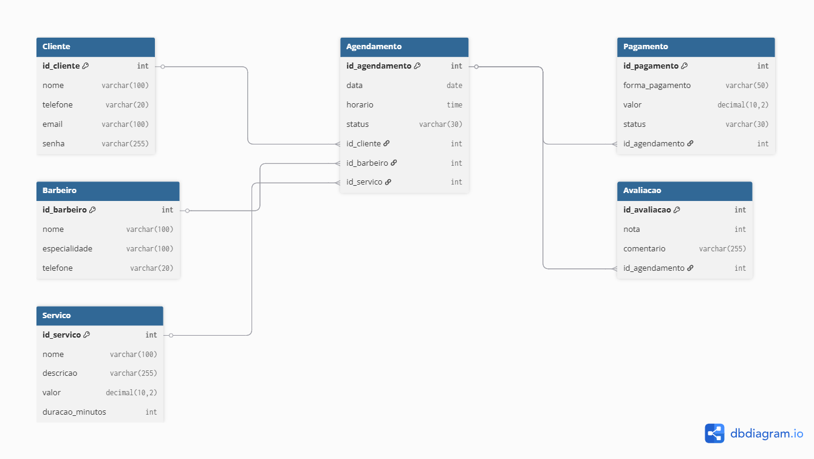

# TORRES BARBER CLUB

Sistema web desenvolvido para gerenciamento de agendamentos e operação administrativa de uma barbearia premium.

Projeto acadêmico interdisciplinar desenvolvido no curso de Análise e Desenvolvimento de Sistemas (PIM III).

---

## Objetivo do Projeto

O sistema Torres Barber Club foi desenvolvido com o objetivo de otimizar o gerenciamento operacional de uma barbearia, permitindo melhor controle administrativo e organização dos atendimentos realizados.

A proposta do sistema é centralizar informações relacionadas aos clientes, barbeiros, serviços, pagamentos e agendamentos, oferecendo uma interface moderna, responsiva e intuitiva.

---

## Funcionalidades

- Agendamento online
- Seleção de barbeiro
- Controle de horários
- Dashboard administrativo
- Interface responsiva
- Estrutura orientada a objetos em C#
- Modelagem de banco de dados relacional
- Consultas SQL
- Prototipação UX/UI
- Organização Scrum com Trello
- Controle de pagamentos
- Histórico de atendimentos
- Indicadores operacionais

---

## Tecnologias Utilizadas

- HTML5
- CSS3
- C#
- SQL
- Figma
- GitHub
- dbdiagram.io
- Trello
- Visual Studio Code
- .NET

---

## Preview do Sistema

### Home Mobile


---

### Fluxo Mobile


---

### Fluxo Tablet


---

### Dashboard Administrativo


---

## Modelagem do Banco de Dados

O banco de dados foi modelado utilizando estrutura relacional, com entidades responsáveis pelo gerenciamento dos clientes, barbeiros, serviços, pagamentos e agendamentos.



---

## Estrutura do Projeto

```text
torres-barber-club/
│
├── frontend/
│   ├── css/
│   ├── index.html
│   └── dashboard-admin.html
│
├── backend-csharp/
│   ├── TorresBarberClub.cs
│   └── backend.csproj
│
├── database/
│   ├── der-torres-barber-club.png
│   └── consultas.sql
│
├── docs/
│   ├── PIM-III-Torres-Barber-Club.pdf
│   ├── dashboard-admin.png
│   ├── fluxo-completo.png
│   ├── fluxo-completo-tablet.png
│   └── preview.png
│
└── README.md
```

---

## Programação Orientada a Objetos em C#

A estrutura backend foi desenvolvida utilizando conceitos de Programação Orientada a Objetos (POO) com a linguagem C#.

Foram implementadas classes representando:

- Cliente
- Barbeiro
- Serviço
- Agendamento
- Pagamento
- Avaliação

A aplicação utiliza conceitos como:

- encapsulamento;
- herança;
- composição;
- reutilização de código.

---

## Banco de Dados e SQL

O sistema utiliza modelagem relacional para organização das informações da aplicação.

As consultas SQL desenvolvidas incluem:

- listagem de clientes;
- listagem de barbeiros;
- consultas de faturamento;
- total de agendamentos;
- relacionamentos utilizando INNER JOIN.

---

## UX/UI Design

O projeto foi desenvolvido seguindo princípios de UX/UI Design com foco em:

- experiência mobile-first;
- responsividade;
- usabilidade;
- navegação intuitiva;
- identidade visual moderna;
- organização visual dos componentes.

---

## Organização Ágil do Projeto

O desenvolvimento foi organizado utilizando conceitos de Engenharia de Software Ágil e metodologia Scrum.

As tarefas foram estruturadas em sprints e organizadas por meio do Trello, permitindo melhor controle do desenvolvimento do projeto.

---

## Status do Projeto

Projeto acadêmico finalizado para apresentação no PIM III.

---

## Repositório

GitHub:
https://github.com/rebecazeri/torres-barber-club

---

## Autora

Rebeca Marinho