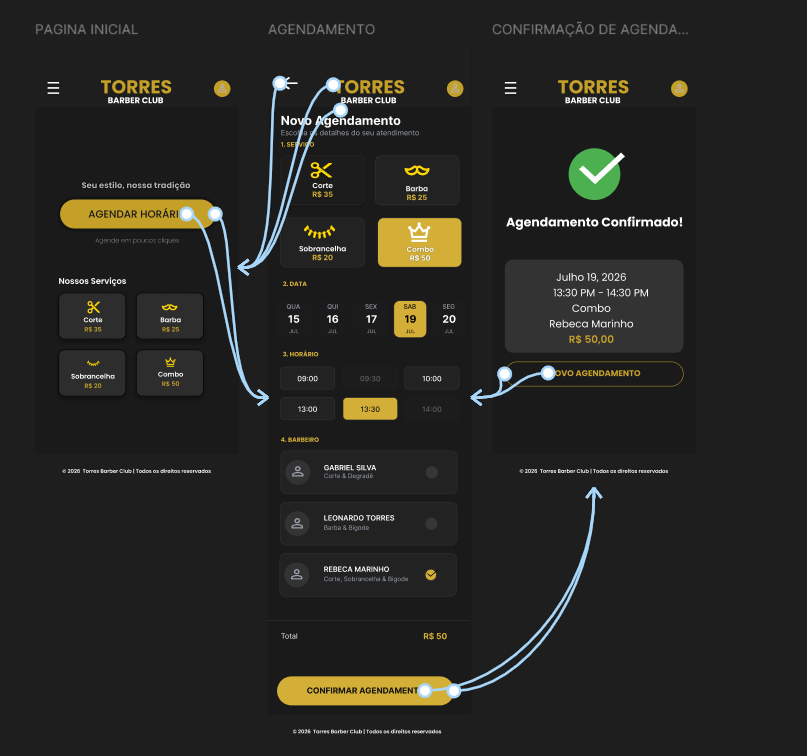
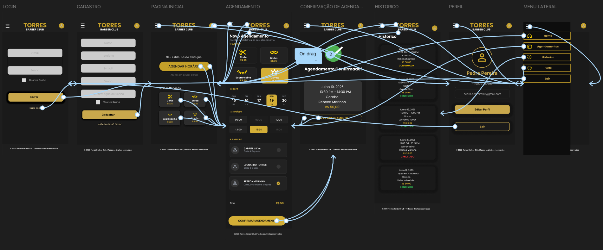
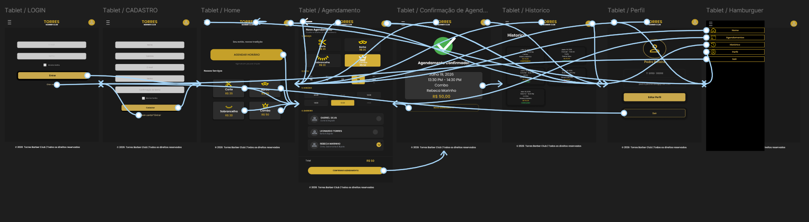
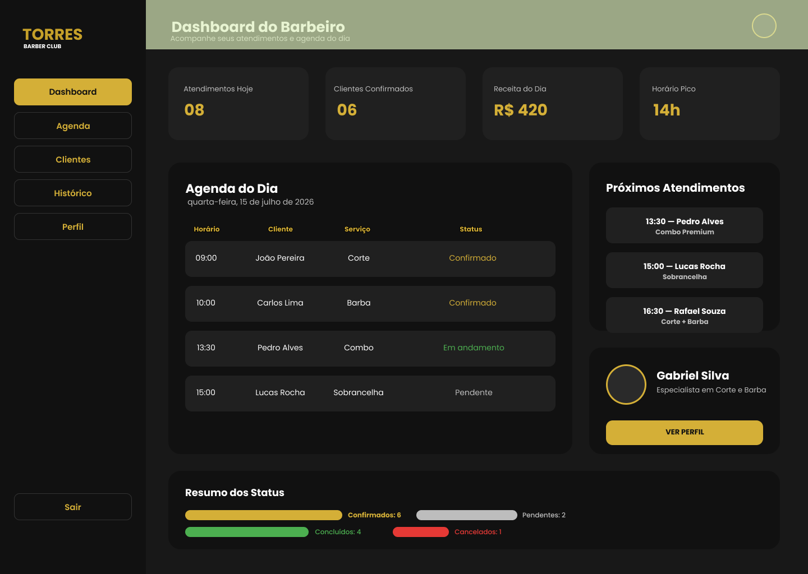

# Torres Barber Club

Sistema web/mobile para gerenciamento de agendamentos de uma barbearia premium.

Projeto acadêmico interdisciplinar do curso de Análise e Desenvolvimento de Sistemas.

---

# Preview do Sistema

---

# Fluxo Completo Mobile

---

# Fluxo Completo Tablet

---

# Dashboard Administrativo

---

# Objetivo

O objetivo do sistema é otimizar o gerenciamento da barbearia Torres Barber Club, permitindo melhor controle de:

* clientes,
* barbeiros,
* serviços,
* horários,
* agendamentos.

---

# Funcionalidades

* Agendamento online
* Escolha de barbeiro
* Seleção de horário
* Confirmação de atendimento
* Interface mobile-first
* Responsividade para tablet
* Dashboard administrativo
* Histórico de agendamentos
* Painel administrativo desktop
* Visualização de agenda
* Controle de atendimentos
* Dashboard gerencial

---

# UX/UI Design

O projeto foi desenvolvido utilizando princípios de UX/UI Design com foco em:

* usabilidade,
* responsividade,
* experiência mobile-first,
* identidade visual premium,
* fluxo intuitivo de navegação.

---

# Ferramentas Utilizadas

* Figma
* GitHub

---

# Status do Projeto

Em desenvolvimento.

Atualmente o projeto possui:

* protótipo mobile finalizado,
* protótipo tablet finalizado,
* dashboard administrativo desktop,
* fluxo navegável completo,
* estrutura visual responsiva,
* identidade visual definida.

---

# Autora

Rebeca Marinho
